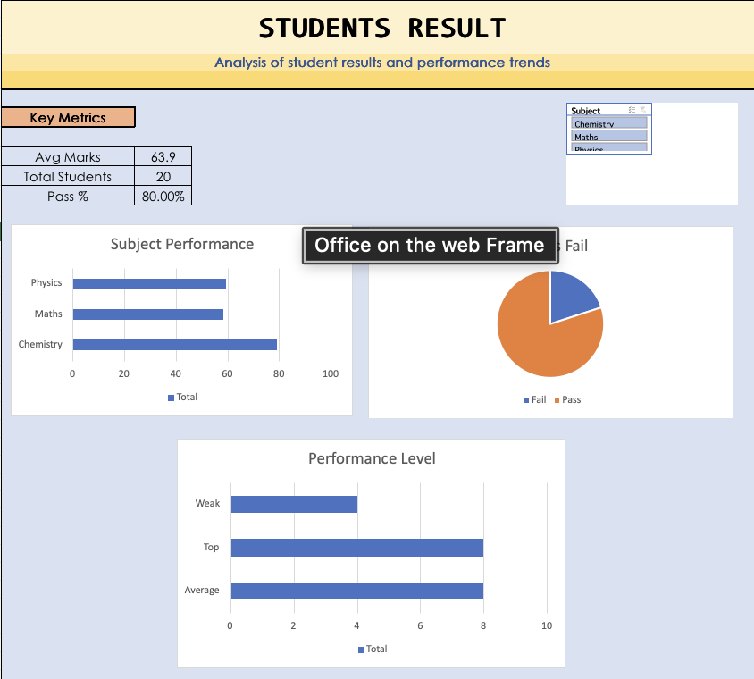

Student Performance Dashboard

Overview
An interactive Excel dashboard designed to analyze student performance across different subjects using data analysis techniques.

Tools & Skills Used
- Microsoft Excel
- Pivot Tables
- Data Cleaning
- KPI Metrics
- Data Visualization (Charts)
- Slicers for interactivity

Key Features
Average Marks by Subject
 Pass vs Fail Distribution
Performance Level Analysis (Top / Average / Weak)
 Interactive filtering using slicers

Dashboard Preview

Key Insights
80% of students passed overall
Majority of students fall in "Average" category
Weak students indicate areas needing improvement
Subject-wise trends help identify strong and weak subjects

Project Objective
To transform raw student data into meaningful insights using Excel and build an interactive dashboard for decision-making.

Outcome
This project demonstrates strong foundational skills in Excel, data analysis, and dashboard creation.

Connect With Me
LinkedIn: https://www.linkedin.com/in/rohit-toprani-18a88a311?utm_source=share_via&utm_content=profile&utm_medium=member_ios 
